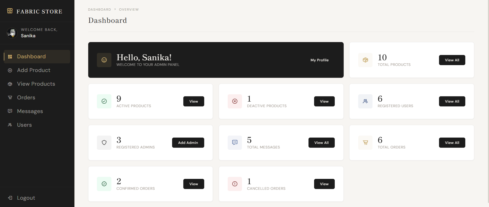
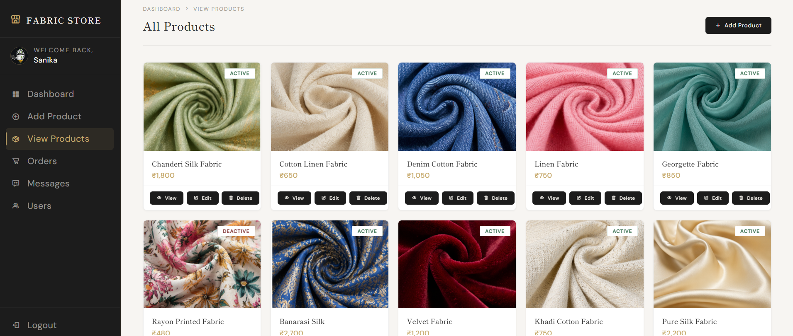
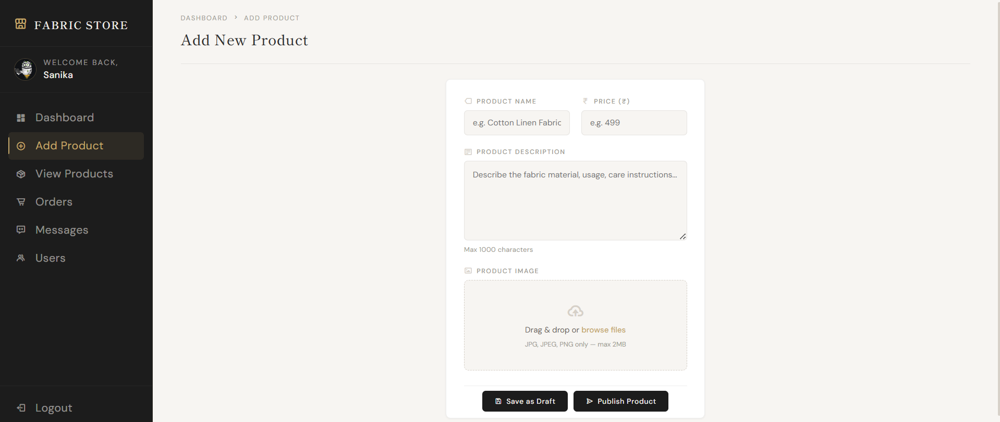
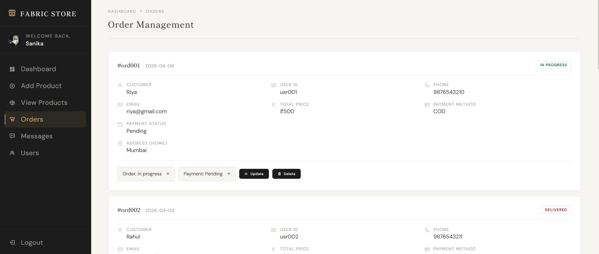

## Fabric Store — Admin Panel

A full-stack **admin panel** for managing a fabric and textiles store, built with **PHP**, **MySQL**, and vanilla **HTML/CSS/JS**. Handles everything from product listings and image uploads to order tracking and customer messages.

## Features

- **Secure Login** — SHA1-hashed passwords with session-based authentication
- **Dashboard** — Live stats: total/active/inactive products, registered users, admins, orders, and messages
- **Product Management** — Add, edit, view, and toggle active/deactive status; image upload with format and size validation (JPG/PNG, max 2MB)
- **Order Management** — View all orders, update order status (in progress / cancelled) and payment status, delete orders
- **User Management** — View all registered customers
- **Messages** — View customer inquiries submitted via the contact form
- **Admin Registration** — Add new admin accounts

## Tech Stack

| Layer | Technology |
|---|---|
| Backend | PHP 7.4+ (PDO, sessions) |
| Database | MySQL 5.7+ |
| Frontend | HTML5, CSS3, Vanilla JS |
| Icons | Boxicons 2.1.4 |
| Alerts | SweetAlert2 |
| Server | Apache (XAMPP / WAMP recommended) |

## 📸 UI Preview







## Project Structure

```
frabic_store-main/
│
├── fabric_store.sql           # Database schema + optional sample data
│
├── admin/
│   ├── login.php              # Admin login
│   ├── register.php           # New admin registration
│   ├── dashboard.php          # Overview with live stats
│   ├── add_product.php        # Add new product with image upload
│   ├── edit_product.php       # Edit existing product
│   ├── view_products.php      # List all products (filter by status)
│   ├── read_product.php       # View single product details
│   ├── orders.php             # Manage orders (update/delete)
│   ├── users.php              # View registered users
│   ├── messages.php           # View customer messages
│   ├── admin_logout.php       # Session logout
│   └── admin_style.css        # Admin panel styling
│
├── components/
│   ├── connect.php            # PDO database connection + session setup
│   ├── admin_header.php       # Shared admin navigation/layout
│   └── alert.php              # Flash message display (success/warning)
│
└── uploads/                   # Product images (auto-managed)
```

## Setup & Installation

### Prerequisites
- [XAMPP](https://www.apachefriends.org/) (or any Apache + MySQL stack)
- PHP 7.4 or higher
- A web browser

### 1. Clone or Extract the Project

```bash
git clone https://github.com/your-username/fabric-store.git
```
Place the folder inside `htdocs/` (XAMPP) or your server's web root.

### 2. Start Your Local Server

Launch **XAMPP** and start both **Apache** and **MySQL**.

### 3. Create the Database

1. Open [phpMyAdmin](http://localhost/phpmyadmin)
2. Click **Import** → upload `fabric_store.sql` → click **Go**

Or via terminal:
```bash
mysql -u root -p < fabric_store.sql
```

### 4. Configure the Database Connection

Open `components/connect.php` and verify:
```php
$host     = 'localhost';
$db_name  = 'fabric_store';
$username = 'root';
$password = '';           

### 5. Set Upload Folder Permissions

```bash
# Linux/Mac
chmod 755 uploads/
```
On Windows/XAMPP this is typically not required.

### 6. Run the App

```
http://localhost/frabic_store-main/admin/login.php
```

## 🗄️ Database Schema

| Table | Description |
|---|---|
| `admin` | Admin accounts (id, name, email, password, profile) |
| `products` | Product listings (id, name, price, image, detail, status) |
| `users` | Registered customers (id, name, email, password) |
| `orders` | Customer orders with status & payment tracking |
| `cart` | Shopping cart items per user |
| `wishlist` | Saved/wishlist items per user |
| `message` | Customer contact form submissions |


## Notes

- Product images must be **JPG or PNG**, max **2MB**
- Images are stored in the `uploads/` folder — ensure it is **writable** by the web server
- Passwords are hashed using **SHA1**. For production, upgrade to `password_hash()` with `PASSWORD_BCRYPT`
- The project uses **PDO** with prepared statements throughout — SQL injection safe

## Future Improvements

- [ ] Customer-facing storefront
- [ ] User registration and login
- [ ] Cart and checkout functionality
- [ ] Payment gateway integration
- [ ] Product search and category filters

## Author

Sanika Kotwal

## 📄 License

This project is open-source and available under the [MIT License](LICENSE).